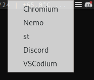

# tray-app-launcher
Simple app launcher made in python

  

## Installation
`pip install pillow pystray`

`cd`  
`git clone https://github.com/maalos/tray-app-launcher.git`  
`cd tray-app-launcher`  
`python main.py`  

### Start on X start
Add `cd ~/tray-app-launcher/ && python main.py &` to `~/.xinitrc` (`&` is for running it in the background)
